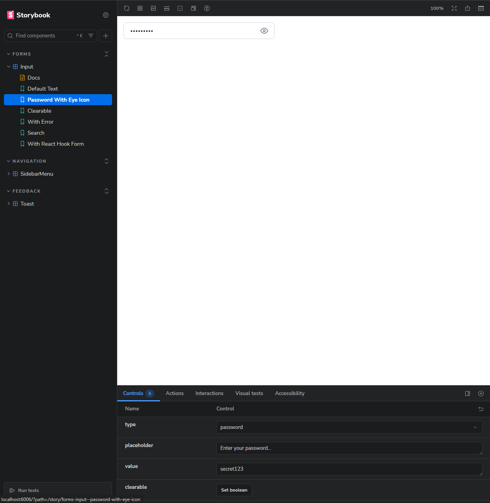
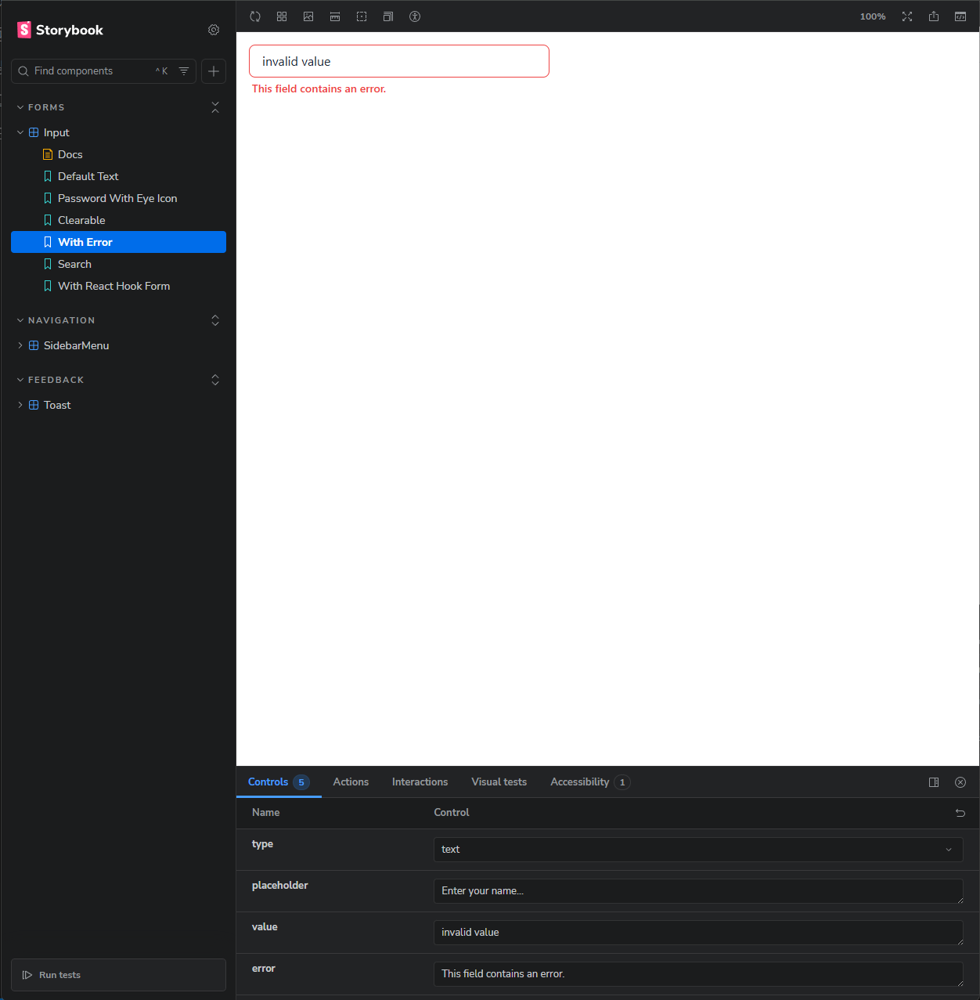
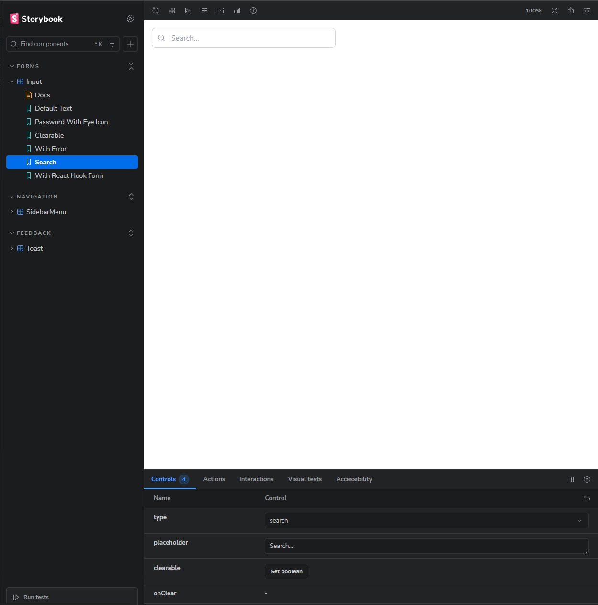
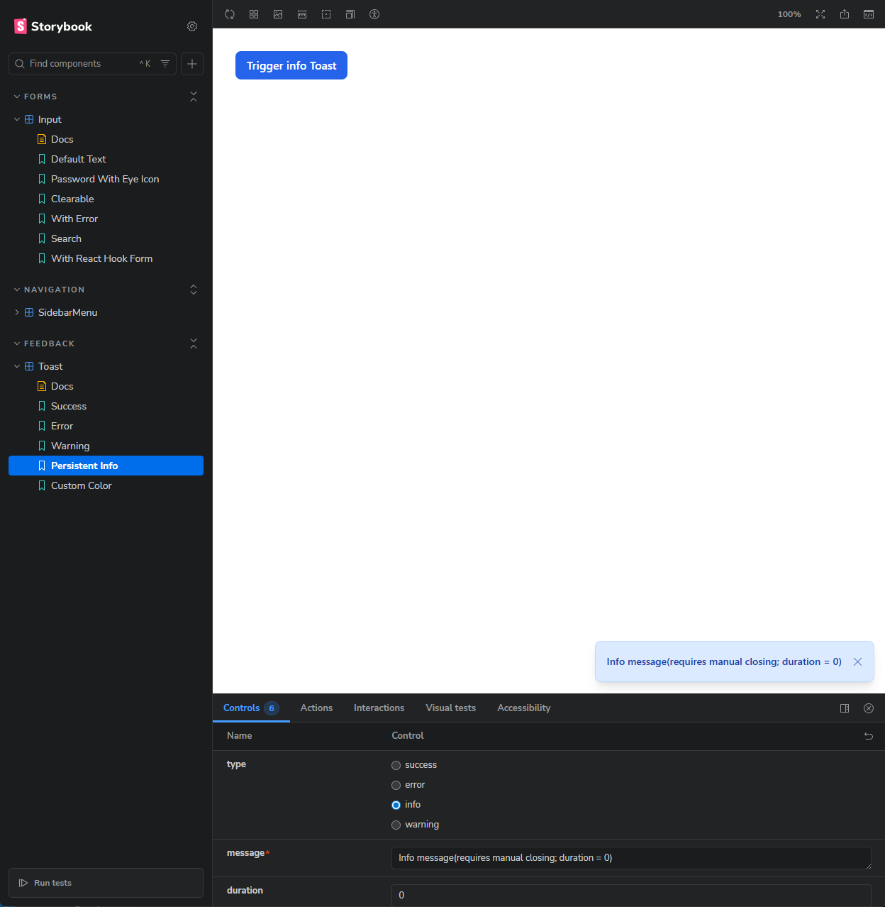
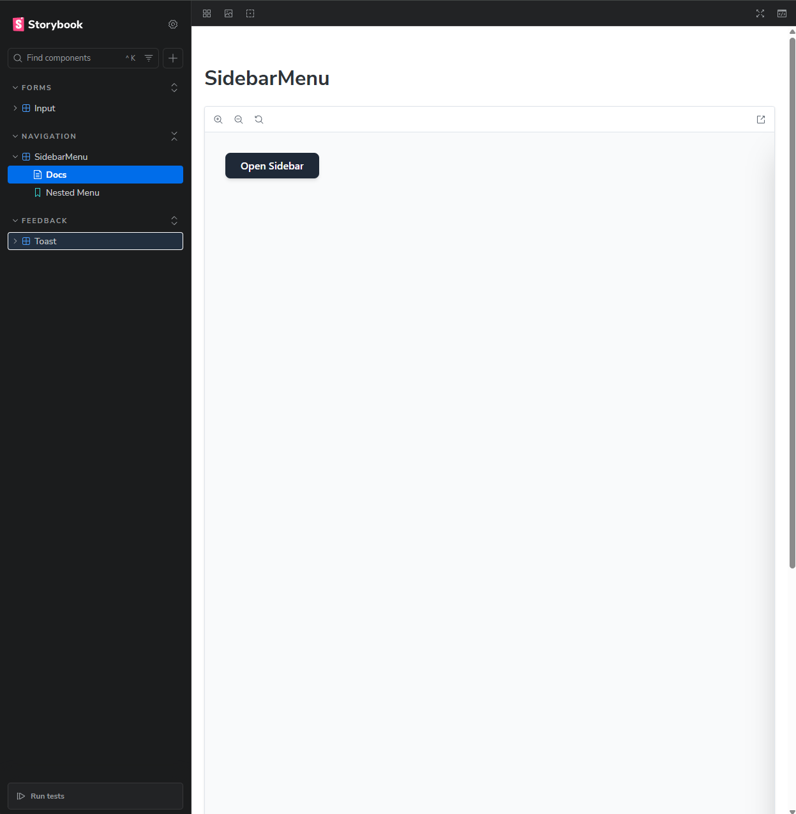
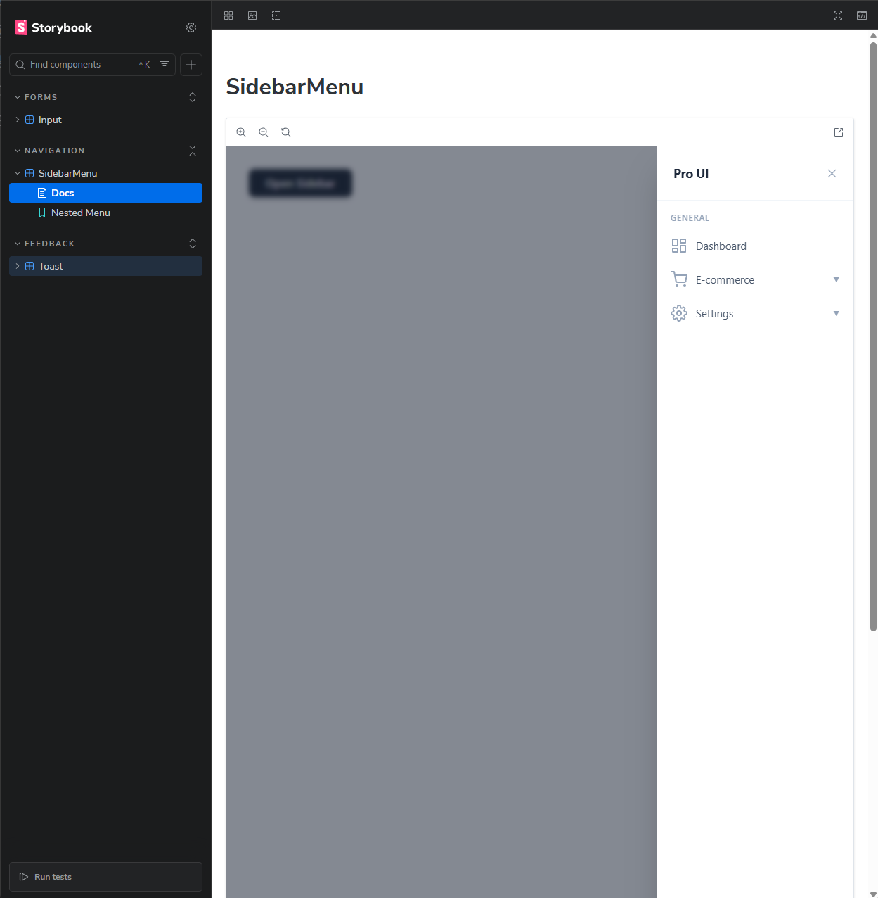
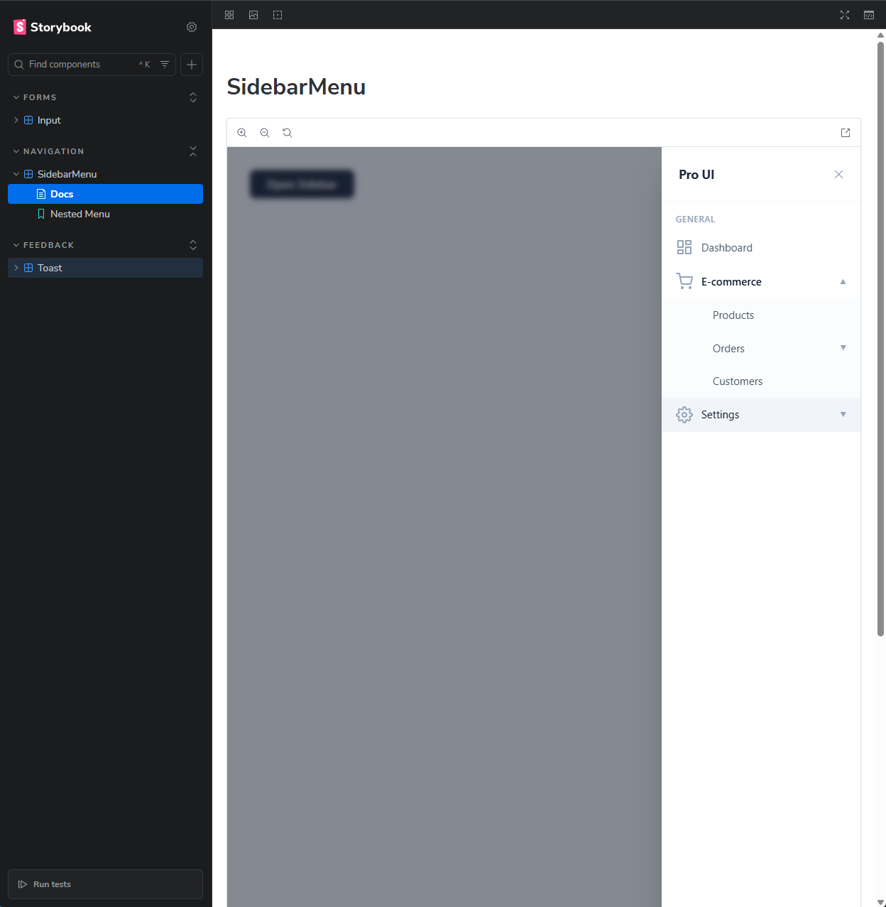

# 🎨 CrewRed UI — React Component Library

A Storybook-based React component library featuring three reusable, fully typed UI components with smooth animations and interactive states.

## 🚀 Tech Stack

| Technology | Purpose |
|---|---|
| **React 18** | UI framework |
| **Vite** | Build tool & dev server |
| **TypeScript** | Type safety |
| **Tailwind CSS** | Utility-first styling |
| **Storybook 10** | Component documentation & playground |
| **React Hook Form** | Form integration demo (bonus) |

> No external component libraries were used — all components are built from scratch.

---

## 📦 Setup Instructions

```bash
# 1. Clone the repository
git clone <repo-url>
cd crewred-test-task

# 2. Install dependencies
npm install

# 3. Start Storybook
npm run storybook
```

Storybook will open at [http://localhost:6006](http://localhost:6006).

---

## 🧩 Component Overview

### 📥 1. Input Component (`<Input />`)

A smart, multi-type input field with built-in interactivity.

**Features:**
- `type="password"` — eye icon to toggle password visibility
- `type="search"` — magnifying glass icon
- `clearable` prop — "✕" button to clear the value
- `error` prop — red border + error message
- `forwardRef` support — seamless React Hook Form integration

**Props:**

| Prop | Type | Default | Description |
|---|---|---|---|
| `type` | `string` | `'text'` | Input type (text, password, number, search) |
| `clearable` | `boolean` | `false` | Show clear button when input has a value |
| `onClear` | `() => void` | — | Callback when clear button is clicked |
| `error` | `string` | — | Error message displayed below the input |

**Screenshots:**

| Default Text | Password with Eye Icon |
|---|---|
|  |  |

| Clearable | With Error |
|---|---|
|  |  |

| Search | React Hook Form Integration |
|---|---|
|  |  |

---

### 🔔 2. Toast Component (`<Toast />`)

A non-blocking notification that slides in from the bottom-right corner.

**Features:**
- Smooth CSS slide/fade transition on enter and exit
- Auto-dismisses after a configurable `duration` (set to `0` for persistent)
- Optional close button via `showCloseButton`
- Customizable background color via `backgroundColor`
- Four semantic variants: `success`, `error`, `warning`, `info`

**Props:**

| Prop | Type | Default | Description |
|---|---|---|---|
| `type` | `'success' \| 'error' \| 'info' \| 'warning'` | — | Visual variant |
| `message` | `string` | — | Toast content |
| `duration` | `number` | — | Auto-dismiss time in ms (0 = persistent) |
| `isOpen` | `boolean` | — | Controls visibility |
| `onClose` | `() => void` | — | Called on dismiss |
| `showCloseButton` | `boolean` | `false` | Show manual close button |
| `backgroundColor` | `string` | — | Custom background color override |

**Screenshots:**

| Success | Error |
|---|---|
|  |  |

| Warning | Info (Persistent) |
|---|---|
|  |  |

| Custom Color |
|---|
|  |

---

### 📚 3. Sidebar Menu Component (`<SidebarMenu />`)

A sliding off-canvas navigation menu with recursive nested submenus.

**Features:**
- Slides in from the right with smooth CSS transforms
- Dark backdrop overlay — click outside to close
- Recursive accordion submenus of any depth
- SVG icons per menu item
- Animated expand/collapse transitions

**Props:**

| Prop | Type | Default | Description |
|---|---|---|---|
| `isOpen` | `boolean` | — | Controls sidebar visibility |
| `onClose` | `() => void` | — | Called when backdrop or close button is clicked |
| `items` | `MenuItem[]` | — | Nested menu tree |
| `title` | `string` | `'Pro Sidebar'` | Header title |

**`MenuItem` interface:**
```typescript
interface MenuItem {
  label: string;
  href?: string;
  icon?: React.ReactNode;
  children?: MenuItem[];
}
```

**Screenshots:**

| Closed State | Open State |
|---|---|
|  |  |

| 1-Level Nesting | 2-Level Nesting |
|---|---|
|  |  |

---

## 📁 Project Structure

```
src/
├── components/
│   ├── Input/
│   │   ├── Input.tsx           # Component implementation
│   │   └── Input.stories.tsx   # Storybook stories
│   ├── Toast/
│   │   ├── Toast.tsx
│   │   └── Toast.stories.tsx
│   └── SidebarMenu/
│       ├── SidebarMenu.tsx
│       └── SidebarMenu.stories.tsx
├── App.tsx
├── main.tsx
└── index.css
```

---